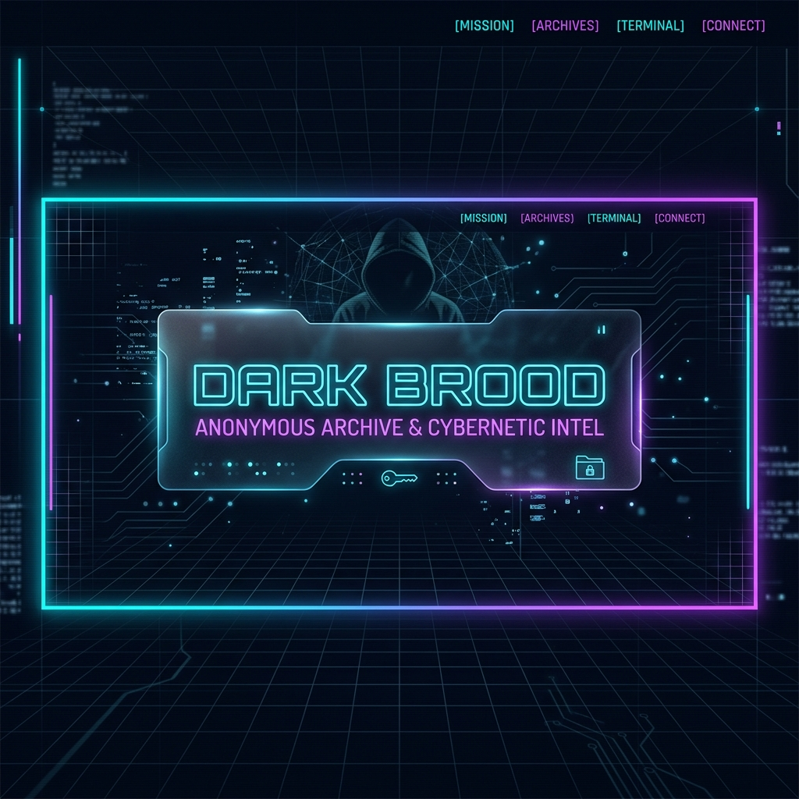

<div align="center">



# 🌑 DarkBrood: 고독과 어둠의 아카이브

**레트로 다크 에어로(Dark Aero) 감성의 익명 게시판 및 운영자 다이어리 아카이브 서비스**

<p align="center">
  
  
  
  
  
  
</p>

</div>

---

## 🔮 프로젝트 소개 (Overview)

**DarkBrood**는 어둠과 고독이라는 독특한 주제 아래 설계된 레트로 다크 에어로(Dark Aero/Retro Cyber) 감성의 풀스택 웹 애플리케이션입니다. 

기존의 정형화된 기술 블로그나 커뮤니티의 틀을 깨고, 깊은 사색을 담는 **다이어리 아카이브**와 본연의 내면을 배설하는 **완전 익명 커뮤니티**, 24시간 동안만 메아리치는 **휘발성 실시간 채팅**을 결합한 사적인 심연의 공간을 제공합니다. 

이 프로젝트는 GCP(Google Cloud Platform) 서버리스 인프라와 배포 자동화(CI/CD) 파이프라인이 유기적으로 연결되도록 아키텍처를 구성하였으며, 클라이언트 환경에 따른 세션 처리 등 클라우드 배포 시 만나는 실제적인 한계들을 기술적으로 해결하는 데 집중하여 개발되었습니다.

---

## 💎 핵심 기능 (Key Features)

*   📢 **어둠의 대시보드 (Notice & Dashboard)**: 운영자의 전체 공지사항을 확인하고 홈 화면의 인트로 소개글을 실시간으로 동적으로 수정할 수 있는 어드민 대시보드 기능을 제공합니다.
*   📝 **사유의 기록소 (Diary Archive)**: 회원가입 및 로그인 절차를 거친 가입자들이 사적이고 고독한 글들을 남기는 공간입니다. 작성자 별 필터링을 지원하여 개개인의 사색의 흐름을 추적할 수 있습니다.
*   👤 **심연의 배설구 (Anonymous Community)**: 완벽한 익명성 보장을 위해 세션별로 임의의 5자리 영숫자 ID(`anonId`)를 발급하여 활동하는 커뮤니티 게시판입니다. GCP Storage 연동을 통해 고용량 이미지 첨부를 지원하며, 댓글을 통한 익명의 토론이 가능합니다.
*   💬 **실시간 메아리 (Sidebar Chat)**: 사이트에 접속한 다른 영혼들과 실시간으로 짧은 메시지를 주고받는 초경량 폴링 채팅 사이드바입니다. 작성된 채팅은 개인 정보 보호와 시스템 정리를 위해 **24시간 후 완전히 소멸(TTL 적용)**합니다.

---

## 🎨 디자인 콘셉트 (Design Philosophy)

*   **Dark Aero & Glassmorphic UI**: 유리창 뒤로 비치는 네온 빛을 구현하기 위해 반투명 아크릴 느낌의 글래스모피즘(Glassmorphism)과 발광(Glow) 효과의 사이언 & 바이올렛 테두리를 적용했습니다.
*   **Atmospheric Grid Layout**: 미세한 그리드 배경 패턴과 레트로 감성의 그라데이션 타이틀 배너를 배치하여 사이버스페이스 특유의 차갑고 고독한 분위기를 연출했습니다.
*   **Fully Responsive**: 데스크톱 넓은 화면에서 최적화된 사이드바 레이아웃이 태블릿 및 모바일 기기에서는 반응형 미디어 쿼리를 통해 모바일 친화적인 싱글 칼럼 레이아웃으로 유연하게 변환되도록 구축되었습니다.

---

## 🛠 기술 스택 (Tech Stack)

### **Backend & Frontend**
*   **Runtime**: Node.js
*   **Framework**: Express.js
*   **Template Engine**: EJS (Embedded JavaScript templates)
*   **Styling**: Vanilla CSS (CSS Variables 기반 프리미엄 다크 테마 시스템)
*   **Upload Handling**: Multer + Multer-Cloud-Storage

### **Database & Cloud Infrastructure (GCP)**
*   **Database**: Google Cloud Firestore (Native Mode)
*   **Storage**: Google Cloud Storage (GCS)
*   **Compute**: Google Cloud Run (Containerized serverless hosting)
*   **Proxy & Edge Routing**: Firebase Hosting (SSL 적용 및 Edge 프록시 라우팅)
*   **CI/CD Pipeline**: GitHub Actions (Docker 이미지 빌드 -> GCP Artifact Registry 푸시 -> Cloud Run 배포 자동화)

---

## 🚀 기술적 도전 및 해결 전략 (Technical Highlights)

### 🔑 1. Firebase Hosting 쿠키 필터링 극복
*   **문제**: Cloud Run 백엔드 앞에 Firebase Hosting을 Edge Proxy로 두었을 때, Firebase CDN 보안 정책상 세션 서명 쿠키(`__session.sig` 등)가 필터링되면서 로그인이 유지되지 않는 현상이 발생했습니다.
*   **해결**: 표준 세션 라이브러리에 의존하지 않고, Payload를 Base64로 인코딩한 후 서버 사이드 비밀 키로 서명한 단일 쿠키(`__session`) 구조를 설계 및 구현했습니다. 이를 통해 Firebase Proxy 규격을 완벽하게 준수하면서도 보안이 담보된 세션 검증 환경을 조성했습니다.

### 💾 2. 제로 설정(Zero-Config) 로컬 하이브리드 아키텍처
*   **문제**: GCP 클라우드 계정이 없거나 복잡한 GCP 리소스를 연동하지 않은 상태에서도 다른 개발자가 원클릭으로 쉽게 프로젝트를 구동할 수 있어야 포트폴리오로서의 접근성이 극대화된다고 판단했습니다.
*   **해결**: GCP 설정 유무에 따라 데이터베이스 및 스토리지 접근 레이어가 다르게 동작하는 하이브리드 구조를 채택했습니다. 
    *   **DB**: Firestore 연결 실패/설정 미비 시 로컬 `db.json`을 기반으로 동작하는 자체 Mock Firestore 엔진(`src/db.js`)이 쿼리(`where`, `orderBy`, `limit` 등)를 모방하여 수행합니다.
    *   **스토리지**: GCS 대신 로컬 파일 시스템(`public/uploads`)에 저장하고 미디어 경로를 로컬 호스트 URL로 변환하는 Fallback 스토리지 엔진(`src/storage.js`)을 탑재했습니다.

### 📁 3. Cloud Storage Uniform Access & 경로 버그 해결
*   **문제**: GCS 버킷의 보안 수준 강화를 위해 'Uniform Bucket-Level Access'를 활성화하자, 개별 업로드 객체에 ACL을 설정하던 기존 코드가 `400 Bad Request` 에러를 유발했습니다. 또한 `multer-cloud-storage` 라이브러리가 경로 접두사를 오인하여 버킷의 루트에 이미지가 저장되는 버그가 존재했습니다.
*   **해결**: 버킷 단에서 `allUsers` 보안 주체에 `Storage Object Viewer` 권한을 바인딩하여 안전하게 익명 이미지를 제공하고, 코드 레벨에서 `uniformBucketLevelAccess: true` 설정을 주입해 에러를 차단했습니다. 더불어 폴더 접두사를 분리하는 `destination` 설정을 통해 경로가 유실되지 않고 일관되게 `uploads/` 하위에 위치하도록 설정 규칙을 통일했습니다.

---

## 📂 프로젝트 폴더 구조 (Directory Structure)

```text
darkbrood/
├── .github/workflows/    # GitHub Actions 배포 워크플로우 (deploy.yml)
├── public/               # 정적 애셋 (CSS, JS, 이미지, 로컬 업로드)
│   ├── css/
│   │   └── global.css    # 프리미엄 다크 에어로 스타일 가이드라인
│   ├── images/           # 디자인 리소스 및 배너
│   └── js/               # 실시간 채팅 폴링 루프 등 클라이언트 스크립트
├── src/                  # 백엔드 핵심 소스코드
│   ├── app.js            # Express 라우팅, 쿠키 세션 및 핵심 서버 비즈니스 로직
│   ├── db.js             # Firestore 연결 및 로컬 JSON 데이터베이스 Fallback 엔진
│   └── storage.js        # GCS 연동 및 로컬 파일 업로드 분기 멀터(Multer) 설정
├── views/                # EJS 템플릿 파일 (index, diary, community 등)
├── Dockerfile            # Cloud Run 컨테이너 빌드용 도커 파일
├── db.json               # 로컬 개발용 자동 생성 Mock DB
└── package.json          # 프로젝트 의존성 관리 파일
```

---

## 📖 문서 링크 (Documentation Links)

이 프로젝트를 직접 로컬에서 실행해보거나 클라우드 환경에 배포하는 구체적인 방법은 아래 문서들을 참고해 주십시오.

*   **[⚙️ 로컬 개발 환경 구동 및 프로젝트 복제 가이드](./README_DEV.md)**
*   **[☁️ GCP 클라우드 무료 배포 가이드](./README_GCP.md)**
